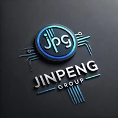

<h2 class="section-title" id="about-me">About Me</h2>

I recently received my B.Eng. degree in Computer Science and Technology from <a href="https://www.csu.edu.cn/">Central South University</a>. During my undergraduate study, I was fortunate to be advised by <a href="https://fingerrec.github.io/">Prof. Jinpeng Wang</a> and <a href="https://qhlin.me/">Dr. Kevin Lin</a>.
I will start my MPhil study at <a href="https://www.hkust-gz.edu.cn/">The Hong Kong University of Science and Technology (Guangzhou)</a> in August 2026.

My research interests include multimodal large language models and reinforcement learning. My recent work focuses on visual code generation.

<h2 class="section-title" id="news">News</h2>

  

    

    
May 2026

    
Two papers were submitted to EMNLP 2026.

  

  

    

    
May 2026

    
Congratulations! <a href="https://csu-jpg.github.io/VCode/">VCode</a> was selected as an oral presentation at the CVPR 2026 Visual Concepts Workshop.

  

  

    

    
Apr. 2026

    
Honored to be named an Outstanding Graduate of Central South University.

  

  

    

    
Feb. 2026

    
Grateful to receive the CSU-JPG Annual Award.

  

  

    

    
Nov. 2025

    
We released <a href="https://csu-jpg.github.io/VCode/">VCode</a>, a multimodal coding benchmark with SVG as symbolic visual representation.

  

  

    

    
Feb. 2025

    
Luckily joined <a href="https://csu-jpg.github.io/">CSU-JPG Lab</a> as an undergraduate research assistant.

  



<h2 class="section-title" id="experience">Experience</h2>

  

    

    

      
Dec. 2025 - Present

      
    

    

      <h3><a href="https://www.antgroup.com/">Inclusion AI, Ant Group</a></h3>
      
Research Intern

      
Focus on multimodal generation and reasoning, and participate in visual code generation research.

    

  

  

    

    

      
Feb. 2025 - Present

      
    

    

      <h3><a href="https://csu-jpg.github.io/">CSU-JPG Lab</a>, <a href="https://www.csu.edu.cn/">Central South University</a></h3>
      
Undergraduate Research Assistant

      
Luckily advised by <a href="https://fingerrec.github.io/">Prof. Jinpeng Wang</a> and <a href="https://qhlin.me/">Dr. Kevin Lin</a>.

    

  


